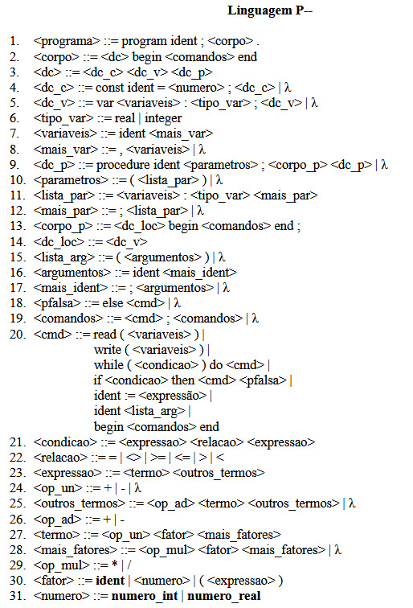
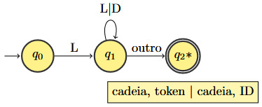
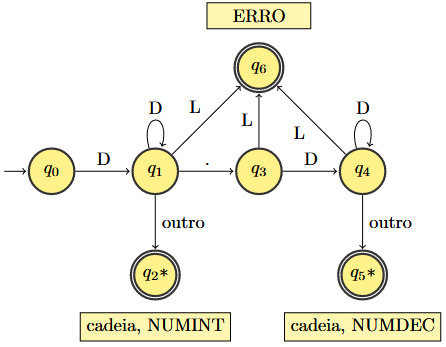
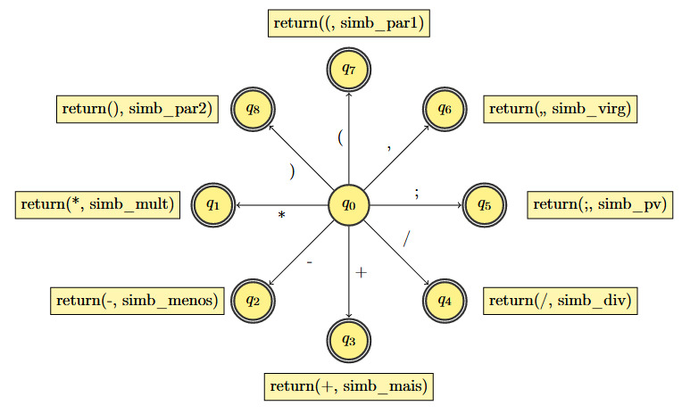
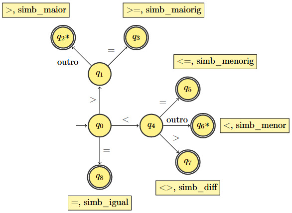

# SCC0605-Teoria-da-Computacao-e-Compiladores
Implementação de analisador léxico desenvolvido para a linguagem P (cuja gramática está definida abaixo) realizada em C, com auxílio de autômatos finitos para identificação das cadeias aceitas.


*Gramática da Linguagem P*

## Funcionamento
O programa fonte (meu_programa.txt) é lido, caractere a caractere, para separação das cadeias. Uma vez identificadas as cadeias, estas são submetidas aos autômatos para identificação dos tokens. O autômatos utilizados estão definidos abaixo:


*Automato Reconhecedor de Identificadores e Palavras Reservadas*


*Automato Reconhecedor de Números*


*Automato Reconhecedor de Símbolos Unitários*


*Automato Reconhecedor de Comparações*


*Automato Reconhecedor de Atribuições*


*Automato Reconhecedor de Comentários*

Uma vez reconhecida por um dos autômatos, a cadeia é adicionada ao arquivo de saída (saida.txt). Caso não seja reconhecida por nenhum dos autômatos, é retornado o erro.

## Como compilar
Para compilação, executar os seguintes comandos:

```
mingw32 - make
./ analisador - lexico
```

## Exemplo de execução
Para a entrada: 

```
program p;
var x@: integer;
BEGIN
        {teste teste som som}
        x:=1.2;
        while(x<3) do
                x:=x+1
{teste comentar eh muito legal!!}
end.
```

A saída produzida é:

```
program, simb_program
p, id
;, simb_pv
var, simb_var
x, id
@, erro('caractere nao permitido')
:, simb_dp
integer, simb_integer
;, simb_pv
begin, simb_begin
{teste teste som som}, comment
x, id
:=, simb_atrib
1.2, num_real
;, simb_pv
while, simb_while
(, simb_par1
x, id
<, simb_menor
3, num_inteiro
), simb_par2
do, simb_do
x, id
:=, simb_atrib
x, id
+, simb_soma
1, num_inteiro
{teste comentar eh muito legal!!}, comment
end, simb_end
., simb_p
```